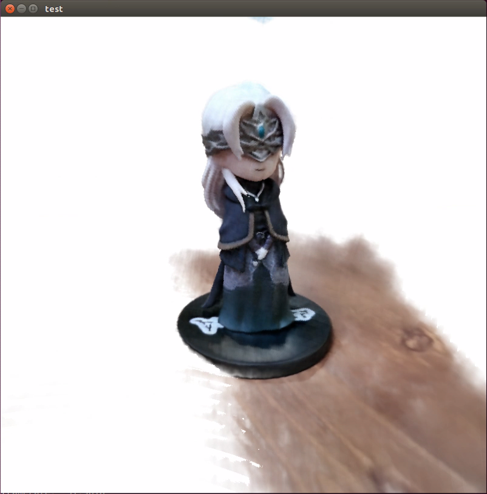

# Not very FastNeRF

This is an unofficial and partial implementation of [FastNeRF](https://arxiv.org/abs/2103.10380).


### Features 
* Training and Caching of the FastNeRF model.
* Rendering at around 30FPS for 800 x 800 images.

### Differences from the paper
* We don't implement the BVH Raytracing to determine the nearest/furthest intersection point. Instead, we use a simple raymarching, which maybe the main speed bottleneck for this implementation.
* We save the cache by dense indices and sparse data, instead of an octree, for simplicity.


### References
* FastNeRF [paper](https://arxiv.org/abs/2103.10380) and [project](https://microsoft.github.io/FastNeRF/).
* Awesome [nerf_pl](https://github.com/kwea123/nerf_pl) as the framework.
* An [image displayer in PyQt5](https://github.com/mackst/opengl-samples/tree/master/displayImage).
* An orbit camera from [pyqtgraph](https://github.com/pyqtgraph/pyqtgraph).


### Install
* `fastnerf`:
  Please follow [nerf_pl](https://github.com/kwea123/nerf_pl), by installing the required packages in `fastnerf/requirements.txt`.
* `pyqtgraph`:
  Please follow [pyqtgraph](https://github.com/pyqtgraph/pyqtgraph), we use the latest 0.12.1, which requires Python3.7+ and Qt5.12-5.15.
  However, if your python environment is not matching, you can clone pyqtgraph's source code and place it under `renderer/pyqtgraph`, since we only use the Qt & OpenGL bindings.


### Train & test
For example:
```bash
cd fastnerf
# Remember to modify the directories in the shell script.
# Train. 
bash scripts/train_firekeeper.sh # create ckpts, logs.
# Test.
bash scripts/test_firekeeper.sh # create results. 
```


### Cache
This is done in a jupyter notebook (since it needs manual modifying of lots of parameters).
* open `fastnerf/extract_mesh_hr_firekeeper.ipynb`
* follow the procedures in the notebook, and the saved cache should be in `fastnerf/output`.


### Render
For example, after caching the data,
```bash
cd renderer
# The parameters should keep the same as the caching parameters.
python qt_renderer_sparse_firekeeper.py
```


It will create a window like:


You can control the camera by your mouse (rotate = drag by the left button, scale = wheel, pan = drag by the middle button).


### Datasets
We tested on two datasets: `silica` and `firekeeper`.
* `silica`: Please refer to [the original release](https://github.com/kwea123/nerf_pl/releases/tag/v2.0.1).
* `firekeeper`: To be continued...

